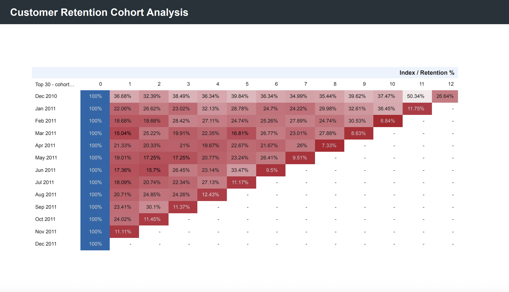

# Customer Retention Cohort Analysis

## Project Overview

This project analyzes e-commerce customer retention using cohort analysis methodology to understand purchasing patterns and customer lifecycle behavior. By grouping customers based on their first purchase month and tracking their activity over time, we identify retention trends, churn patterns, and opportunities for improving customer lifetime value.

## What is Cohort Analysis?

Cohort analysis is a analytical technique that divides customers into groups (cohorts) based on a shared characteristic or experience within a defined time period. In this project, cohorts are defined by the month of first purchase.

**Why Cohort Analysis?**
- Reveals retention patterns that overall metrics mask
- Identifies when customers are most likely to churn
- Enables comparison between customer groups acquired at different times
- Helps measure the effectiveness of retention strategies over time
- Provides actionable insights for improving customer lifetime value

**Key Metrics:**
- **Cohort Month**: The month when a customer made their first purchase
- **Cohort Index**: Number of months since first purchase (0 = first month, 1 = one month later, etc.)
- **Retention Rate**: Percentage of original cohort still making purchases
- **Active Customers**: Count of customers who made purchases in that period
- **Revenue**: Total revenue generated by the cohort in that period

## Technical Implementation

### Database Setup
- **Platform**: Google Cloud SQL (MySQL 8.0.41)
- **Region**: asia-south2-b
- **Connection**: Public IP with authorized networks for Looker Studio

### SQL Pipeline

#### 1. Data Cleaning
Filtered raw transaction data to exclude returns and null values:

```sql
CREATE OR REPLACE VIEW purchases AS
SELECT *
FROM transactions
WHERE CustomerID IS NOT NULL
  AND InvoiceDate IS NOT NULL
  AND Quantity > 0
  AND InvoiceNo NOT LIKE 'C%';
```

This removes cancelled orders (prefixed with 'C'), null customer records, and invalid transactions.

#### 2. Cohort Definition
Assigned each customer to their first purchase month cohort:

```sql
CREATE TABLE customer_cohort AS
SELECT
  CustomerID,
  DATE_FORMAT(MIN(STR_TO_DATE(InvoiceDate, '%d/%m/%y %k:%i')), '%Y-%m-01') AS cohort_month,
  MIN(STR_TO_DATE(InvoiceDate, '%d/%m/%y %k:%i')) AS first_purchase_date
FROM purchases
GROUP BY CustomerID;
```

Each customer belongs to exactly one cohort based on when they first appeared in the dataset.

#### 3. Monthly Activity Calculation
Tracked customer activity across all months for each cohort:

```sql
CREATE OR REPLACE VIEW cohort_monthly AS
SELECT
  c.cohort_month,
  STR_TO_DATE(DATE_FORMAT(STR_TO_DATE(p.InvoiceDate, '%d/%m/%y %k:%i'), '%Y-%m-01'), '%Y-%m-%d') AS order_month,
  TIMESTAMPDIFF(MONTH, STR_TO_DATE(c.cohort_month, '%Y-%m-%d'),
    STR_TO_DATE(DATE_FORMAT(STR_TO_DATE(p.InvoiceDate, '%d/%m/%y %k:%i'), '%Y-%m-01'), '%Y-%m-%d')) AS cohort_index,
  COUNT(DISTINCT p.CustomerID) AS active_customers,
  SUM(p.Quantity * p.UnitPrice) AS revenue
FROM purchases p
JOIN customer_cohort c ON p.CustomerID = c.CustomerID
GROUP BY c.cohort_month, order_month, cohort_index;
```

The `TIMESTAMPDIFF` calculates how many months elapsed since the customer's cohort month, creating the cohort_index.

#### 4. Retention Metrics
Calculated retention percentages using window functions:

```sql
CREATE OR REPLACE VIEW cohort_metrics AS
SELECT
  cohort_month,
  cohort_index,
  active_customers,
  revenue,
  FIRST_VALUE(active_customers) OVER (PARTITION BY cohort_month ORDER BY cohort_index) AS cohort_size,
  ROUND(100.0 * active_customers / 
    FIRST_VALUE(active_customers) OVER (PARTITION BY cohort_month ORDER BY cohort_index), 2) AS retention_pct,
  ROUND(revenue / NULLIF(active_customers, 0), 2) AS revenue_per_active_customer
FROM cohort_monthly;
```

`FIRST_VALUE` window function captures the initial cohort size (Month 0) to calculate retention percentages.


## Visualization

Created a retention heatmap in Google Looker Studio using:
- **Chart Type**: Pivot Table with conditional formatting
- **Rows**: cohort_month (sorted ascending)
- **Columns**: cohort_index (0-12 months)
- **Values**: retention_pct
- **Color Scale**: Red (0%) → White (50%) → Blue (100%)

## Key Findings

### Critical Retention Drop
75-85% of customers never make a second purchase. Month 0 to Month 1 represents the most significant churn point across all cohorts.

### Cohort Performance Variation
December 2010 cohort retained 36.68% in Month 1, while November 2011 retained only 11.11% - a 3.3x difference indicating external factors significantly impact retention.

### Declining Trend
Recent cohorts (Sep-Dec 2011) show progressively weaker Month 1 retention compared to earlier cohorts, suggesting deteriorating customer experience or acquisition quality.

### Retention Stabilization
Customers who survive past Month 3 typically stabilize around 20-30% retention, representing a core loyal customer base.

### Exponential Decay Pattern
Retention follows a predictable curve: rapid drop in months 0-3 (50-80% loss), gradual decline in months 4-6 (10-15% loss), then plateau after month 6.

## Business Recommendations

### Immediate Actions
1. **Post-Purchase Engagement**: Implement email sequences, satisfaction surveys, and incentives within the first 30 days
2. **Second Purchase Campaign**: Offer targeted discounts or promotions to first-time buyers
3. **Quality Audit**: Investigate why recent cohorts underperform - check product quality, shipping times, customer service

### Strategic Initiatives
1. **December 2010 Analysis**: Study what made this cohort successful - promotional campaigns, product mix, seasonal factors
2. **Customer Segmentation**: Identify characteristics of the 20-30% who become loyal customers
3. **Early Warning System**: Monitor Month 1 retention as a leading indicator of business health
4. **Retention Target**: Set goal to improve Month 1 retention from 15-20% to 30-35%

### Measurement
Track cohort retention monthly and compare new cohorts against historical benchmarks. A/B test retention strategies on new customer cohorts.

## Dashboard Visualization


*Retention heatmap showing customer activity patterns across cohorts. Blue indicates high retention (100%), white shows moderate retention (50%), and red represents low retention (0%).*

## Technologies Used
- Google Cloud SQL (MySQL 8.0.41)
- Google Looker Studio
- SQL (Views, Window Functions, CTEs)

## Future Enhancements
- Geographic cohort analysis
- Product category retention patterns
- Predictive churn modeling
- Customer lifetime value forecasting
- Automated cohort reporting dashboard

---

**Analysis Period**: December 2010 - December 2011  
**Total Customers Analyzed**: 4,372 unique customers  
**Total Cohorts**: 13 monthly cohorts
